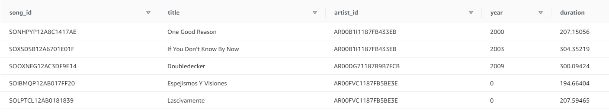
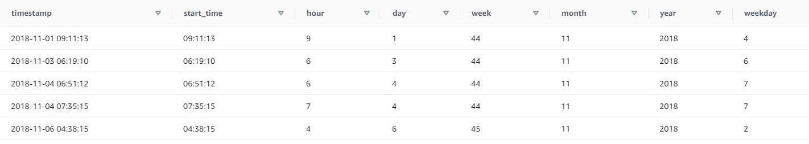

## Udacity - Data Engineering Nanodegree

### Project 2: Data Warehouse with Amazon Redshift

#### Table of contents

* [Project Description](#project-description)
* [Files in Repository](#files-in-repository)
* [Setup](#setup)
* [Schema](#schema)
    *   [Fact Table](#fact-table)
    *   [Dimension Tables](#dimension-tables)
    *   [Table Design Optimisation](#table-design-optimisation)
          * [Distribution style](#distribution-style)
          * [Sort key](#sort-key)
    *   [Entity Relationship Diagram (ERD)](#erd)
* [ETL Processes and Pipeline](#etl)
* [Summary information of the tables](#summary-table-info)
* [Example Queries](#example-queries)
* [References](#references)

#### Project Description
In this project, a Redshift-hosted database is created to move the Sparkify's
growing user base and song database from on-premises data warehouse onto the
cloud. The main goals of this project are to build an ETL pipeline that extracts
the data in JSON file format from S3, stage them in Redshift and transform
data into a set of dimensional tables for the analytics team to continue
analysing data and finding insights on users' music preferences.
The data will be divided into **one fact table** and **four dimension tables**
(namely artists, songs, users, and time) which primary keys are referred to
in the fact table as foreign keys. With one fact table and four dimension tables,
the database will be structured in a star schema.

#### Files in Repository
In addition to the files in images folder, there are four other files in the
repository:
* `create_tables.py` drops and creates tables for the star schema in Redshift.
* `etl.py` contains ETL pipeline where data is loaded from S3 into staging tables
    and processed into analytics tables on Redshift.
* `sql_queries.py` contains all the SQL queries, which functions are imported
    into two other files above.
* `README.md` provides discussion on this project.

#### Setup
To run the ETL pipeline in this project, type the two following commands
in the Project Workspace Terminal consecutively:  
`$ python create_tables.py`  
`$ python etl.py`

#### Schema
The star schema for queries on song play analysis consists of the
following tables.

##### Fact Table

1.  **songplays** - records in log data associated with song plays i.e. records with page
    `NextSong`.
  *   _songplay_id, start_timestamp, user_id, level, song_id, artist_id, session_id, location, user_agent_

##### Dimension Tables

2.  **artists** - artists in music database
  * _artist_id, name, location, latitude, longitude_

3.  **songs** - songs in music database
  * _song_id, title, artist_id, year, duration_

4.  **users** - users in the app
  *   _user_id, first_name, last_name, gender, level_

5.  **time** - timestamps of records in songplays broken down into specific units
  *   _timestamp, start_time, hour, day, week, month, year, weekday_

##### Table Design Optimisation
For an improved query performance, the following distribution style and
sort key selection are implemented in tables creation.

###### Distribution style
1. The dimension tables that are frequently joined with songplays table and have
multiple columns in the table queried, will be defined with a distribution style
 of _ALL_. As the goal of finding insights on users' music preferences, the tables
 that likely to fall into this category are `users` and `songs`.

2. The _artist_id_ column in `artist` table is likely to be joined with `songplays`
table to obtain artist's name value therefore the _artist_id_ is defined as
DISTKEY in both `artist` table and `songplays` table.  

###### Sort key
Defining sort key in a table has beneficial effect on query performance. According
to [Bauer (2013)](#ref-bauer), the general criteria of data that would make good sort key are
as follow:
 *  A field that is frequently used with `WHERE` clause to filter data, particularly
 if that data is highly selective.
 *  A datestamp of the data as it is being loaded.
 *  A field that is frequently used to join other tables, particularly if it qualifies
 as sort key for both tables. This will allow merge join to be performed on the
 selected columns very quickly.
 *  Columns that are used to declare primary key. Those columns define uniqueness,
 and often will be joined to, filtered on, and aggregated by.
 * A field that is used in `GROUP BY` and `ORDER BY` on a consistent basis.

Following the sort key criteria listed above, the sort key selected for each table
are shown below:
| Table name     | Sort key(s)              |
| :------------- | :----------------------- |
| users          | user_id                  |
| songs          | artists_id, song_id      |
| artists        | artist_id                |
| time           | timestamp                |
| songplays      | start_timestamp, user_id |

##### Entity Relationship Diagram (ERD)
Entity Relationship Diagram (ERD) of this star schema is shown below. 

#### ETL Processes and Pipeline
After song and event log datasets are loaded from S3 to staging tables (namely
 `staging_songs` and `staging_events`) using a COPY command, the ETL process and
 pipeline are broken down into two steps:

1.  **ETL Process on `staging_songs`** 
    Data from `staging_songs` table are loaded into `songs` and `artists` tables.
    A copy of `songs` table is distributed to every node for table design optimisation

2.  **ETL Process on `staging_events`** 
    Each of the log JSON file contains multiple logs of users activity on the music app on the
    day, and they are inserted into the `users`, `songplays`, and `time` tables.

#### Summary information of the tables
The summary information of the tables in `dev` database is as follow:

#### Example queries

Below are screenshots of some of the SQL queries: 

***Songplays table***   

***Artists table*** 

***Songs table*** 

***Users table*** 

***Time table*** 

***Top 10 most-listened-to artists in November 2018*** 

***Top 10 most-listened-to songs in November 2018*** 

#### References

Bauer, S. 2013. _Getting Started with Amazon Redshift_, Packt Publishing Ltd., Birmingham UK.
